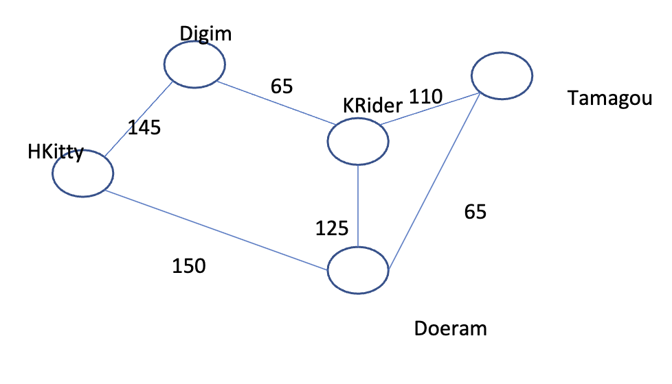

# Rail-Connections-Algo

The Kawaii islands have many towns that attract tourists. They typically spent days visiting various
towns. The only transport between the towns are railroads, and not every pair of towns are connected
directly by a railroad. Also, because the rail are build in different time periods, they are not compatible
with one another. For example, if a tourist wants to go from HKitty to Tamagou via Doeram, one need to
stop at Doeram and change trains.
(BTW, if there is a rail that connects two towns directly, then the rail go both ways – the same rail that
go from HKitty to Doeram will travel back from Doeram to HKitty).
Now the tourist department of Kawaii islands want to better plan the movement of tourists on the
islands. One thing they want to do is to find a route between two towns such that the route can carry
the maximum number of tourists (this can be useful for managing the sales of rail tickets between any
two towns, or when in emergency, determine what is the best way to evacuate people from a town).
For example. Consider the following graph that describe the town and the rail that connecting them.
Each vertex is a town, and an edge denote a railroad connecting the two towns. The number of on the
edges denote how many people that rail can take for each run (we call it the rail’s capacity).

Consider the following route from HKitty to Doeram to Tamagou. Suppose the rail from HKitty to
Doeram have a capacity of 150, and the rail from Doeram to Tamagou have a capacity of 65. Then this
route from HKitty to Tamagou has a capacity of 65. (i.e. Suppose with a full train from HKItty to Doeram
trying to go to Tamagou. Then 65 tourists can go from HKitty to Doeram, and then immediate hop on
the train from Doeram to Tamagou, while the other 85 must wait for the next train).
Now there may be other routes that can go from HKItty to Tamagou that will provide higher capacity.
For example, the route HKitty -> Doeram -> KRider -> Tamagou has a capacity of 110.
In fact, given a path, the capacity of the path (the maximum number of tourist that can travel without
waiting) is equal to the capacity of the edge that has the smaller capacity along the path.

The goal of your program is given information about towns and connecting rails between them (with
capacity information), find the route from one town to another with maximum capacity.
